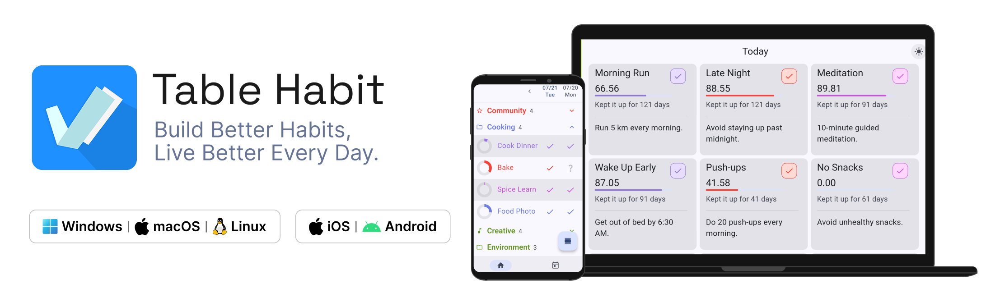
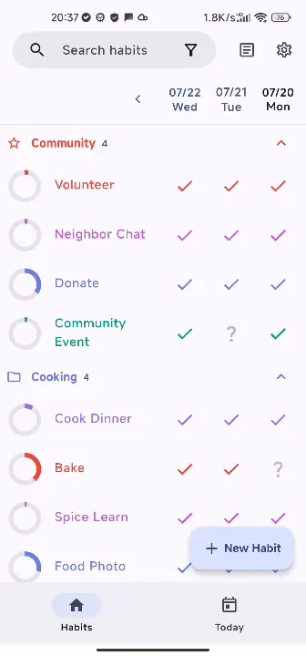
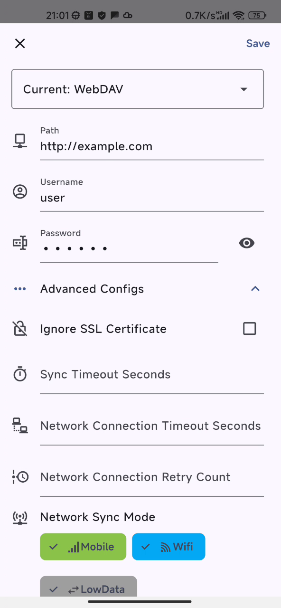
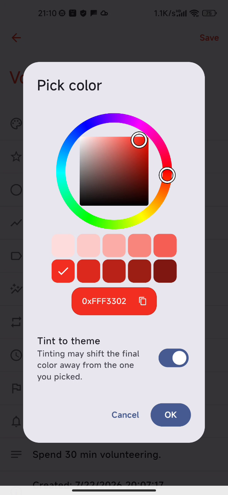
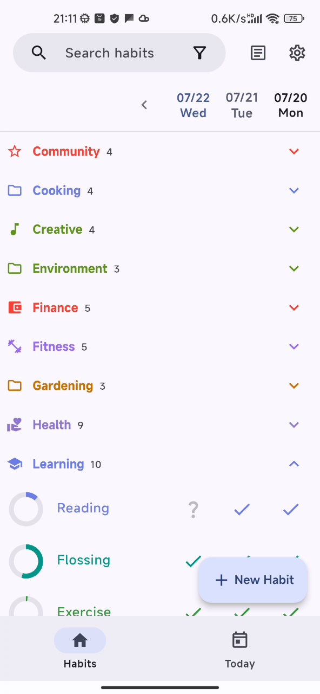
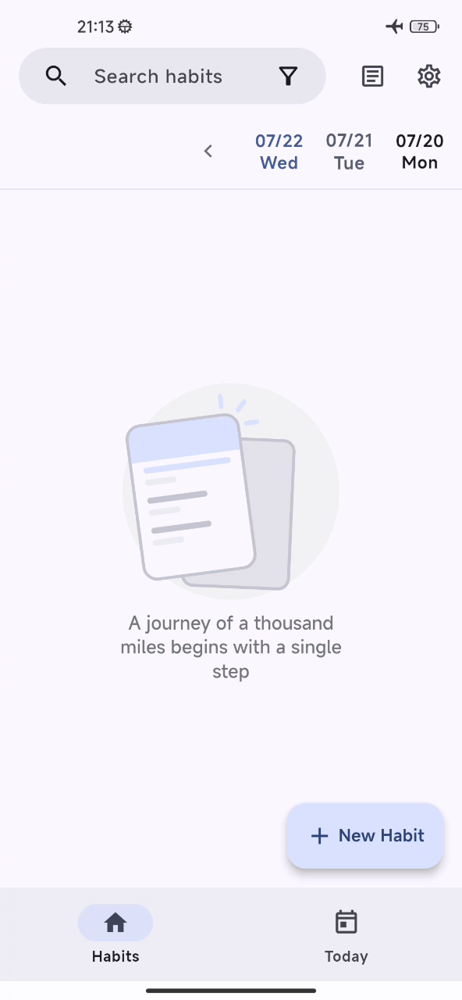
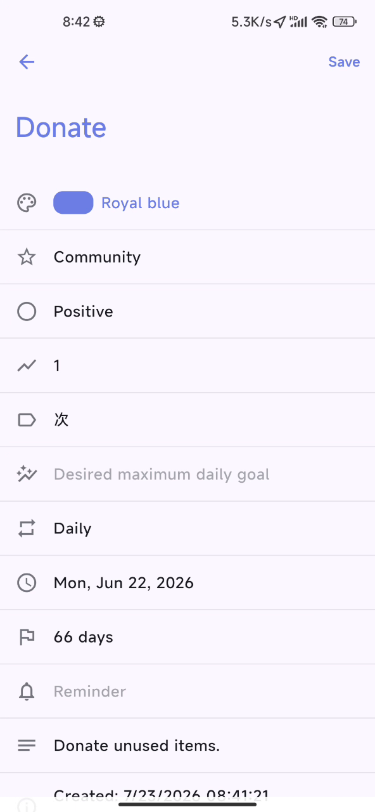

<!-- <p align="center">
  
</p>  -->

<h1 align="center">Table Habit</h1>
<p align="center"><em>Track micro habits. Grow every day.</em></p>

<p align="center">
  <picture>
    <source media="(prefers-color-scheme: dark)" srcset="docs/README/images/feature-hero-showcase-dark.png" />
    <source media="(prefers-color-scheme: light)" srcset="docs/README/images/feature-hero-showcase.png" />
    
  </picture>
</p>

<p align="center">
  <a href="https://github.com/FriesI23/mhabit/releases"></a>
  <a href="https://github.com/FriesI23/mhabit/releases"></a>
  <a href="https://github.com/FriesI23/mhabit/actions/workflows/release-app.yml"></a>
  <a href="LICENSE"></a>
  <br>
  
  
  <a href="https://hosted.weblate.org/engage/mhabit/"></a>
  <a href="https://discord.gg/Hxst5can"></a>
</p>

---

**Table Habit** is a **free and open-source** habit tracker that helps you build
micro habits with a unique scoring system, rich growth charts, and
**cross-device WebDAV sync**. Available on Android, iOS, macOS, Windows, and
Linux — **no ads, no account required**. See the translation badge above for supported languages. Licensed under Apache 2.0.

<p align="center">
  <a href="https://github.com/FriesI23/mhabit/releases/latest"></a>
  &nbsp;
  <a href="https://f-droid.org/packages/io.github.friesi23.mhabit"></a>
  &nbsp;
  <a href="https://flathub.org/apps/io.github.friesi23.mhabit"></a>
</p>
<p align="center">
  <a href="https://play.google.com/store/apps/details?id=io.github.friesi23.mhabit"></a>
  &nbsp;
  <a href="https://apps.apple.com/app/table-habit/id6744886469"></a>
  &nbsp;
  <a href="https://testflight.apple.com/join/aJ5PWqaR"></a>
  &nbsp;
  <a href="https://apps.microsoft.com/detail/9NG22PL73NGZ"></a>
</p>

<details>
<summary><b>✨ Specs</b> — Free · Offline-first · WebDAV Sync</summary>

| Feature           | Description                                                                                                  |
| ----------------- | ------------------------------------------------------------------------------------------------------------ |
| **Price**         | Free — no ads, no in-app purchases                                                                           |
| **License**       | Apache 2.0                                                                                                   |
| **Platforms**     | Android · iOS · macOS · Windows · Linux                                                                      |
| **Sync**          | WebDAV (Nextcloud, Koofr, self-hosted)                                                                       |
| **Languages**     | See the translation badge above for live count — Arabic, Chinese, Czech, French, German, Hebrew, Japanese, … |
| **Offline-first** | Fully functional without internet                                                                            |
| **Account**       | Not required — no sign-up, no telemetry                                                                      |
| **Tech Stack**    | Flutter · Dart · SQLite · Provider                                                                           |

</details>

## Why Table Habit?

<p align="center">
  <picture>
    <source media="(prefers-color-scheme: dark)" srcset="docs/README/images/feature-growth-chart-dark.webp" />
    <source media="(prefers-color-scheme: light)" srcset="docs/README/images/feature-growth-chart.webp" />
    
  </picture>
  &nbsp;
  <picture>
    <source media="(prefers-color-scheme: dark)" srcset="docs/README/images/feature-sync-settings-dark.png" />
    <source media="(prefers-color-scheme: light)" srcset="docs/README/images/feature-sync-settings.png" />
    
  </picture>
  &nbsp;
  <picture>
    <source media="(prefers-color-scheme: dark)" srcset="docs/README/images/feature-customization-01-dark.png" />
    <source media="(prefers-color-scheme: light)" srcset="docs/README/images/feature-customization-01.png" />
    
  </picture>
</p>
<p align="center">
  <picture>
    <source media="(prefers-color-scheme: dark)" srcset="docs/README/images/feature-customization-02-dark.png" />
    <source media="(prefers-color-scheme: light)" srcset="docs/README/images/feature-customization-02.png" />
    
  </picture>
  &nbsp;
  <picture>
    <source media="(prefers-color-scheme: dark)" srcset="docs/README/images/feature-offline-empty-dark.png" />
    <source media="(prefers-color-scheme: light)" srcset="docs/README/images/feature-offline-empty.png" />
    
  </picture>
  &nbsp;
  <picture>
    <source media="(prefers-color-scheme: dark)" srcset="docs/README/images/feature-edit-habit-dark.png" />
    <source media="(prefers-color-scheme: light)" srcset="docs/README/images/feature-edit-habit.png" />
    
  </picture>
</p>

- **📊 Smart Scoring — Not Just Streaks**
  Quantifies your consistency beyond daily check-ins. Growth curves show your long-term progress with separate scoring models for "do" and "don't" habits.

- **🔄 WebDAV Sync — Own Your Data**
  Sync seamlessly across devices via Nextcloud, Koofr, or self-hosted servers. Zero vendor lock-in and complete data privacy — your habit data always stays yours.

- **🎨 Deep Customization**
  Per-habit custom colors with built-in swatches and a full color picker. Collapsible habit grouping with drag-and-drop reorder, plus Material 3 + Dynamic Color theming.

- **🔓 100% Open Source · Privacy First**
  Apache 2.0 licensed. No ads, no telemetry, no account required. Native JSON import/export, Loop Habit Tracker migration, and fully functional offline.

- **🌍 Truly Global**
  Community-driven translations via Weblate with full RTL support (Arabic, Hebrew, Persian). 18+ languages and growing.

- **🖥️ Cross-Platform**
  Android, iOS, macOS, Windows, Linux. Available on Google Play, App Store, F-Droid, Flathub, and Microsoft Store.

### 🌍 Global & Cross-Platform

- **🌍 Truly Global:** Community-driven translations via Weblate with full RTL support (Arabic, Hebrew, Persian). 18+ languages and growing.
- **🖥️ Cross-Platform:** Android, iOS, macOS, Windows, Linux. Available on Google Play, App Store, F-Droid, Flathub, and Microsoft Store.

## Installation

### Quick Install (CLI)

```bash
# macOS — Homebrew
brew tap FriesI23/brew-repo
brew install table-habit

# macOS — Mac App Store (via mas)
mas install 6744886469

# Windows — Scoop
scoop bucket add friesi23-bucket https://github.com/FriesI23/scoop-bucket
scoop install friesi23-bucket/mhabit

# Linux — Flatpak
flatpak install flathub io.github.friesi23.mhabit
```

> **More options**: [AltStore][altstore-source] · [SideStore][sidestore-source] · [IzzyOnDroid][lzzyondroid-myapp] · [Obtainium][obtainium-myapp] · [TestFlight Beta][ios-testflight-pre-release]
>
> Full installation guide: **[Wiki – Installation][wiki-installation]**

<details>
<summary>All Distribution Channels</summary>

| Platform    | Stable Channels                                                                        | Beta / Sideload                                                                                                                     |
| ----------- | -------------------------------------------------------------------------------------- | ----------------------------------------------------------------------------------------------------------------------------------- |
| **Android** | [Google Play][play-myapp] · [F-Droid][fdroid-myapp] · [IzzyOnDroid][lzzyondroid-myapp] | [GitHub APK][github-myapp] · [Obtainium][obtainium-myapp]                                                                           |
| **iOS**     | [App Store][appstore-myapp]                                                            | [TestFlight][ios-testflight-pre-release] · [AltStore][altstore-source] · [SideStore][sidestore-source] · [GitHub IPA][github-myapp] |
| **macOS**   | [App Store][appstore-myapp] · [Homebrew][homebrew-tap-wiki]                            | [TestFlight][ios-testflight-pre-release] · [GitHub DMG][github-myapp]                                                               |
| **Windows** | [Microsoft Store][msstore-myapp] · [Scoop][scoop-bucket-wiki]                          | [GitHub MSIX][github-myapp]                                                                                                         |
| **Linux**   | [Flathub][flathub-source]                                                              | [GitHub Flatpak][github-myapp]                                                                                                      |

</details>

## Translation

Table Habit is available in many languages thanks to our amazing community
translators on Weblate (see badge above for live count).

<a href="https://hosted.weblate.org/engage/mhabit/">
  
</a>

Help translate Table Habit into your language:
[**Join Weblate**][weblate-engage] or submit a PR to
the `weblate-translation` branch.

## Roadmap

| Status | Feature                       | Notes                                              |
| :----: | ----------------------------- | -------------------------------------------------- |
|   ✅   | **Custom Colors**             | Per-habit swatches + color picker ([v1.25.1+164])  |
|   ✅   | **Loop Habit Tracker Import** | CSV import from Loop Habit Tracker ([v1.25.7+172]) |
|   ✅   | **Habit Groups**              | Drag-and-drop reorder, collapsible ([v1.26.1+174]) |
|   🟨   | **Android Widget**            | In progress                                        |
|   🟨   | **iOS Widget**                | In progress                                        |
|   ⬜   | **More Sync Backends**        | Beyond WebDAV — planned                            |

[v1.25.1+164]: https://github.com/FriesI23/mhabit/releases/tag/v1.25.1+164
[v1.25.7+172]: https://github.com/FriesI23/mhabit/releases/tag/v1.25.7+172
[v1.26.1+174]: https://github.com/FriesI23/mhabit/releases/tag/v1.26.1+174

## Contributing

Contributions make open source great! Here's how you can help:

- **Code**: Pick an [open issue][github-issues], follow the
  [Flutter style guide][flutter-style-guide],
  and open a PR.
- **Documentation**: Wiki pages live in `docs/wiki/` — edit them and open a
  PR. CI auto-syncs to the [GitHub Wiki][github-wiki].
- **Translations**: Join [Weblate][weblate-engage]
  or edit `.arb` files in `lib/l10n/`.
- **Bug Reports**: Open a [GitHub Issue][github-issues].

<details>
<summary>Development Quickstart</summary>

```bash
# Clone and bootstrap
git clone https://github.com/FriesI23/mhabit.git
cd mhabit
make bootstrap   # or: make init

# Code generation (after changing l10n, colors, or annotations)
make gen

# Lint, fix, verify
make aio         # gen + fix + verify-generated
make test        # run all tests
```

See **[Build from Source][wiki-build]**
on the wiki for platform-specific build instructions.

</details>

## Support

Table Habit is a one-person indie project. If you find it useful, consider
supporting its development:

<p align="center">
  <a href="https://www.buymeacoffee.com/d49cb87qgww"></a>
</p>

<details>
<summary>Crypto &amp; QR Codes</summary>

|                         Alipay                          |                           WeChat Pay                           |
| :-----------------------------------------------------: | :------------------------------------------------------------: |
|  |  |

- **ETH**: [`0x35FC877Ef0234FbeABc51ad7fC64D9c1bE161f8F`](https://etherscan.io/address/0x35FC877Ef0234FbeABc51ad7fC64D9c1bE161f8F)
- **BTC**: [`bc1qz2vjews2fcscmvmcm5ctv47mj6236x9p26zk49`](https://blockchair.com/bitcoin/address/bc1qz2vjews2fcscmvmcm5ctv47mj6236x9p26zk49)

</details>

> Visit **[Donors][page-donors]** to see
> everyone who has supported this project. Thank you!

---

<p align="center">
  <a href="https://www.star-history.com/?repos=FriesI23%2Fmhabit&type=date&legend=top-left">
    <picture>
      <source media="(prefers-color-scheme: dark)" srcset="https://api.star-history.com/chart?repos=FriesI23/mhabit&type=date&theme=dark&legend=top-left" />
      <source media="(prefers-color-scheme: light)" srcset="https://api.star-history.com/chart?repos=FriesI23/mhabit&type=date&legend=top-left" />
      
    </picture>
  </a>
</p>

## License

```
Copyright 2023-2026 Fries_I23

Licensed under the Apache License, Version 2.0 (the "License");
you may not use this file except in compliance with the License.
You may obtain a copy of the License at

    http://www.apache.org/licenses/LICENSE-2.0

Unless required by applicable law or agreed to in writing, software
distributed under the License is distributed on an "AS IS" BASIS,
WITHOUT WARRANTIES OR CONDITIONS OF ANY KIND, either express or implied.
See the License for the specific language governing permissions and
limitations under the License.
```

<p align="center">
  <sub>Made with ❤️ by <a href="https://github.com/FriesI23">Fries_I23</a>
  and <a href="https://github.com/FriesI23/mhabit/graphs/contributors">contributors</a></sub>
</p>

[altstore-source]: https://friesi23.icu/altstore-repo/pages/altstore.html
[sidestore-source]: https://friesi23.icu/altstore-repo/pages/sidestore.html
[lzzyondroid-myapp]: https://apt.izzysoft.de/fdroid/index/apk/io.github.friesi23.mhabit
[obtainium-myapp]: https://apps.obtainium.imranr.dev/redirect?r=obtainium://app/%7B%22id%22%3A%22io.github.friesi23.mhabit%22%2C%22url%22%3A%22https%3A%2F%2Fgithub.com%2FFriesI23%2Fmhabit%22%2C%22author%22%3A%22FriesI23%22%2C%22name%22%3A%22Table%20Habit%22%2C%22additionalSettings%22%3A%22%7B%5C%22includePrereleases%5C%22%3Atrue%2C%5C%22fallbackToOlderReleases%5C%22%3Atrue%2C%5C%22filterReleaseTitlesByRegEx%5C%22%3A%5C%22%5C%22%2C%5C%22filterReleaseNotesByRegEx%5C%22%3A%5C%22%5C%22%2C%5C%22verifyLatestTag%5C%22%3Afalse%2C%5C%22sortMethodChoice%5C%22%3A%5C%22smartname-datefallback%5C%22%2C%5C%22useLatestAssetDateAsReleaseDate%5C%22%3Afalse%2C%5C%22releaseTitleAsVersion%5C%22%3Afalse%2C%5C%22trackOnly%5C%22%3Afalse%2C%5C%22versionExtractionRegEx%5C%22%3A%5C%22%5E%28pre-%29%3Fv%28%5C%5C%5C%5Cd%2B%5C%5C%5C%5C.%5C%5C%5C%5Cd%2B%5C%5C%5C%5C.%5C%5C%5C%5Cd%2B%29%5C%5C%5C%5C%2B%28%5C%5C%5C%5Cd%2B%29%24%5C%22%2C%5C%22matchGroupToUse%5C%22%3A%5C%22%242%5C%22%2C%5C%22versionDetection%5C%22%3Afalse%2C%5C%22releaseDateAsVersion%5C%22%3Afalse%2C%5C%22useVersionCodeAsOSVersion%5C%22%3Afalse%2C%5C%22apkFilterRegEx%5C%22%3A%5C%22%5C%22%2C%5C%22invertAPKFilter%5C%22%3Afalse%2C%5C%22autoApkFilterByArch%5C%22%3Atrue%2C%5C%22appName%5C%22%3A%5C%22Table%20Habit%5C%22%2C%5C%22appAuthor%5C%22%3A%5C%22Friesi23%5C%22%2C%5C%22shizukuPretendToBeGooglePlay%5C%22%3Afalse%2C%5C%22allowInsecure%5C%22%3Afalse%2C%5C%22exemptFromBackgroundUpdates%5C%22%3Afalse%2C%5C%22skipUpdateNotifications%5C%22%3Afalse%2C%5C%22about%5C%22%3A%5C%22%5C%22%2C%5C%22refreshBeforeDownload%5C%22%3Atrue%2C%5C%22includeZips%5C%22%3Afalse%2C%5C%22zippedApkFilterRegEx%5C%22%3A%5C%22%5C%22%7D%22%2C%22categories%22%3A%5B%22Health%22%5D%2C%22overrideSource%22%3A%22GitHub%22%2C%22allowIdChange%22%3Atrue%7D
[ios-testflight-pre-release]: https://testflight.apple.com/join/aJ5PWqaR
[wiki-installation]: https://github.com/FriesI23/mhabit/wiki/Installation
[github-issues]: https://github.com/FriesI23/mhabit/issues
[flutter-style-guide]: https://github.com/flutter/flutter/blob/master/docs/contributing/Style-guide-for-Flutter-repo.md
[github-wiki]: https://github.com/FriesI23/mhabit/wiki
[weblate-engage]: https://hosted.weblate.org/engage/mhabit/
[wiki-build]: https://github.com/FriesI23/mhabit/wiki/Dev꞉-Build-From-Source
[page-donors]: https://github.com/FriesI23/mhabit/wiki/Donors
[play-myapp]: https://play.google.com/store/apps/details?id=io.github.friesi23.mhabit&referrer=utm_source%3Dappbadge
[fdroid-myapp]: https://f-droid.org/packages/io.github.friesi23.mhabit
[appstore-myapp]: https://apps.apple.com/app/table-habit/id6744886469
[msstore-myapp]: https://apps.microsoft.com/detail/9NG22PL73NGZ?referrer=appbadge&mode=direct
[github-myapp]: https://github.com/FriesI23/mhabit/releases/latest
[flathub-source]: https://flathub.org/apps/io.github.friesi23.mhabit
[homebrew-tap-wiki]: https://github.com/FriesI23/mhabit/wiki/Installation#homebrew---custom-tap
[scoop-bucket-wiki]: https://github.com/FriesI23/mhabit/wiki/Installation#scoop---custom-bucket
